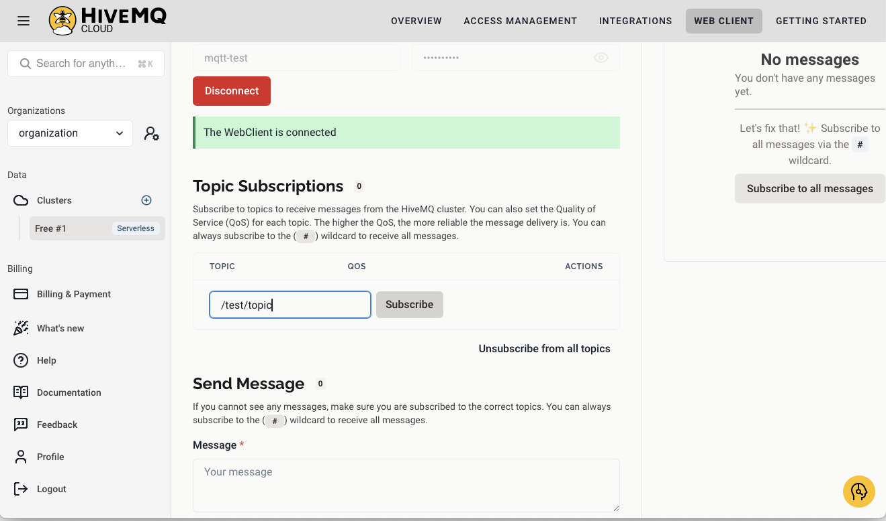

# Installing and Setting up Mosquitto on Raspberry Pi

MQTT (Message Queuing Telemetry Transport https://mqtt.org) is a lightweight messaging protocol designed for small sensors and mobile devices, optimized for high-latency or unreliable networks. **Mosquitto** is a lightweight open-source message broker that implements the MQTT protocol. This guide will walk you through the installation and setup of Mosquitto on a Raspberry Pi and using the online broker HiveMQ (https://www.hivemq.com).


## Installation Steps

1. **Update and Upgrade Packages**

Open a terminal in the Raspberry Pi and make sure your system is up to date by running:

```sh
sudo apt update
sudo apt upgrade
```

2. **Install Mosquitto Broker and Client**s

To install **Mosquitto** server and clients, enter the following command:

```sh
sudo apt install mosquitto mosquitto-clients
```

3. **Disable Mosquitto Service autostart (only if you don't want it to automatically start)** 

After the installation, the **Mosquitto** server should be active. You can check the status with:
```sh
sudo systemctl status mosquitto
```
You will get a information similar to this:
```text
● mosquitto.service - Mosquitto MQTT Broker
     Loaded: loaded (/lib/systemd/system/mosquitto.service; enabled; preset: enabled)
     Active: active (running) since Tue 2024-11-19 11:39:29 WET; 2min 12s ago
       Docs: man:mosquitto.conf(5)
             man:mosquitto(8)
    Process: 2553 ExecStartPre=/bin/mkdir -m 740 -p /var/log/mosquitto (code=exited, status=0/SUCCESS)
    Process: 2554 ExecStartPre=/bin/chown mosquitto /var/log/mosquitto (code=exited, status=0/SUCCESS)
    Process: 2556 ExecStartPre=/bin/mkdir -m 740 -p /run/mosquitto (code=exited, status=0/SUCCESS)
    Process: 2557 ExecStartPre=/bin/chown mosquitto /run/mosquitto (code=exited, status=0/SUCCESS)
   Main PID: 2558 (mosquitto)
      Tasks: 1 (limit: 9252)
        CPU: 22ms
     CGroup: /system.slice/mosquitto.service
             └─2558 /usr/sbin/mosquitto -c /etc/mosquitto/mosquitto.conf
```

It says the service is `active (running)` and also some information about the configuration file `/etc/mosquitto/mosquitto.conf` and the log dir `/var/log/mosquitto` (the log file is named `mosquitto.log`)

When the server is running, we can see the log data, issuing the command:
```sh
sudo tail -f /var/log/mosquitto/mosquitto.log
```

This command shows the last 10 lines of the file, and "follows" the log, presenting new information that is entered to the log. When you need to stop this command, you should press `CTRL+C`

Here is a extract of the log command:
```text
1732027183: mosquitto version 2.0.11 starting
1732027183: Config loaded from /etc/mosquitto/mosquitto.conf.
1732027183: Starting in local only mode. Connections will only be possible from clients running on this machine.
1732027183: Create a configuration file which defines a listener to allow remote access.
1732027183: For more details see https://mosquitto.org/documentation/authentication-methods/
1732027183: Opening ipv4 listen socket on port 1883.
1732027183: Opening ipv6 listen socket on port 1883.
1732027183: mosquitto version 2.0.11 running
1732027277: New connection from 127.0.0.1:58220 on port 1883.
1732027277: New client connected from 127.0.0.1:58220 as auto-AA9FD11D-5535-F9A5-8023-36D99CB82B62 (p2, c1, k60).
```

4. **Starting mosquito manually (Alternative)**
If you don't want **mosquitto** server to start automatically, you can run the following command on a terminal to disable the automatic start. 
```sh
sudo systemctl disable mosquitto
```

Next time the raspberry starts up, the system will not run the **mosquitto** server. You can always start/stop **mosquitto**, issuing the following commands:
```sh
sudo systemctl start mosquitto
```
and,
```sh
sudo systemctl stop mosquitto
```

## Testing Mosquitto

When the **mosquitto** server is installed, it will only allow connections from `localhost`. This information can be seen in the log extract presented above, or issuing the following command.
```sh
sudo tail -f /var/log/mosquitto/mosquitto.log
```

To test if the communication is working, we can use the **mosquitto** client commands `mosquitto_pub`and `mosquitto_sub`

To subscribe a topic, enter in a terminal the following command:
```sh
mosquitto_sub -h 127.0.0.1 -t /test/topic
```

The `-h` flag is used to specify the **"mqtt broker host"**  and the `-t` flag is to specify the **"topic"** we are subscribing. To test if the command was successfully, you can see if the info on the **mosquitto** server log, or publishing to the `/test/topic` in another terminal, using the following command:
```sh
mosquitto_pub -h 127.0.0.1 -t /test/topic -m "Message to publish"
```
The `-m`flag specifies the message to be send. If all works ok, you should receive the message on the terminal where you are subscribing this topic.

## Configuring Mosquitto to accept connections from other machines

You can edit the **Mosquitto** server configuration file to adjust settings. Open it using:

```sh
sudo nano /etc/mosquitto/mosquitto.conf
```

This command will open the configuration file in **nano** editor. By default, **Mosquitto** only allows connections from localhost, to allow remote connections, add the following line in the beginning of the file:

```plaintext
listener 1883
allow_anonymous true
```

After entering the text, press `CTRL+X`to exit. **Nano** will ask if you want do save the file, select **yes**, and then to confirm the name of the file, press **enter** to confirm the name.

**Note:** Allowing anonymous access is not recommended for production environments, in your production environments consider setting up authentication. For more advanced configurations, refer to the [Mosquitto Documentation](https://mosquitto.org/documentation/).

2. **Restart Mosquitto**

After making changes to the configuration file, restart **Mosquitto** server to apply the changes:

```sh
sudo systemctl restart mosquitto
```

You've successfully installed and set up **Mosquitto** on your Raspberry Pi. You can now use it to handle **MQTT** messaging for your IoT **projects**.

# Setting Up HiveMQ to use MQTT

HiveMQ is a scalable, enterprise-grade MQTT broker designed to facilitate reliable, efficient communication between connected devices and applications. It enables real-time data transfer, particularly in IoT (Internet of Things) environments, ensuring low latency and high availability for message delivery. HiveMQ supports MQTT 3.1.1 and MQTT 5 standards, making it versatile for a wide range of use cases.

1. **Create a HiveMQ Account**
- Visit the [HiveMQ Cloud website](https://www.hivemq.com/mqtt-cloud-broker/).
	

- Click on **Sign Up Free**
	

- Click on the **gray SignUp button** and **Fill** in the registration form with your email, and password. After filling in the form, press the **yellow Sign Up button**
	
- The previous message is presented, and you will receive an email on your account. Verify your email address by clicking on the received email to activate the account.
	
- Fill in your data and press **Continue** to finalize the account creation

2. **Create a Cluster**
	- Log in to your HiveMQ account dashboard. 
	- Navigate to **Clusters** and click **Create Cluster** (if not presented with the following option). 
	
	- Select the **Create Serverless Cluster button**
	
	- The clusters main page presents the newly created cluster. Press the **Manage Cluster button** to have the overview page of your cluster
	
	- Take note of the ÙRL, and the `Port`of your cluster, you will need them to publish/subscribe to this server.
	
3. **Set Up a User**
	- In your **Cluster overview** page, click on the **Access Management** menu option. The credentials management page is presented.
	
	-  In the **Credentials** section section, press the **Edit button**.
	
	- Now press the **Add Credentials button**.
	
	- Provide your credentials info:
	   - **Username**: e.g., `mqtt-user`
	   - **Permission**: Publish and Subscribe
	   - **Password**: Secure password for authentication (Need to have a uppercase letter and a digit).
	- Save the credentials for future use.
	

4. **Connect to the Cluster from the web interface**
	- In your **Cluster overview** page, click on the **Web Client** menu option. The web client page is presented.
	 	- Enter the credentials you have created and press the **Connect button**.
	
	- To subscribe to a topic, enter the topic name on the **Topic Subscription box** and press the **Subscribe button**.
	
	- You can subscribe several topics
	
	- When messages arrive for the subscribed topics on the **Web Client** they are presented on the list on the right side of the page
	
	- From this page you can also publish messages on the **Send Message section**
5. **Connect to the Cluster from python/command line**
	- Annotate the connection details:
		- **Broker URL**: (e.g., `your-cluster.hivemq.cloud`)
		- **Port**: 8883 (default for secure MQTT over TLS)
	- Use an MQTT client (e.g., **mosqitto** command line clients or a custom client using libraries like `paho.mqtt` in Python) to connect.
	- You can subscribe topics in your cluster with:
	 ```sh
	mosquitto_sub -h yourserveraddress.s1.eu.hivemq.cloud -u mqtt-test -P MqTT-pass1 -p 8883 -t /test/topic
	 ```
	
	- And can publish to the cluster with:
	 ```sh
	mosquitto_pub -h yourserveraddress.s1.eu.hivemq.cloud -u mqtt-test -P MqTT-pass1 -p 8883 -t /test/topic -m "test HiveMQ"
	 ```
	 
	 The new flags in these commands are `-u`to specify the username and `-P` (P is in uppercase) to specify the password.
# Communicating with MQTT Broker in Python

To publish/subscribe to MQTT brokers from python, you need to instal the `paho.mqtt`library. Install it on the raspberry pi, using the following pip command in your python environment:
```bash
pip install paho-mqtt
```

Using Python with the `paho-mqtt` library use this program to subscribe to the `/test/topic`:
```python
# Import the Paho MQTT library for communication with an MQTT broker.
import paho.mqtt.client as mqtt  

# Callback function triggered when a message is received from the broker.
def on_message(client, userdata, message):
    # Decode and print the received message and the topic it was published to.
    print(f"Received '{message.payload.decode()}' from topic '{message.topic}'")

# Create an MQTT client instance.
client = mqtt.Client()

# Set the username and password for broker authentication.
# Replace "mqtt-user" and "your-password" with the actual 
# credentials for your MQTT broker.
client.username_pw_set("mqtt-user", "your-password")

# Connect to the MQTT broker.
# Replace "your-cluster.hivemq.cloud" with your broker's address or domain.
# Port 8883 is used for secure connections over TLS/SSL.
client.connect("your-cluster.hivemq.cloud", 8883)

# Assign the callback function to handle messages received from the broker.
client.on_message = on_message

# Subscribe to a specific MQTT topic.
# Replace "/test/topic" with the topic you want to subscribe to.
client.subscribe("/test/topic")

# Enter a loop that keeps the client running to listen for incoming messages.
# This ensures the client stays connected and responsive.
client.loop_forever()

```

The following command shows publish and subscribe, and includes another `callback` which is called whenever the program connects to the MQTT broker (in the localhost)

```python
import paho.mqtt.client as mqtt

# Define the MQTT settings
BROKER_ADDRESS = "localhost"
PORT = 1883
TOPIC = "/test/topic"

# Callback when the client receives a response from the server
def on_connect(client, userdata, flags, rc):
	print("Connected with result code " + str(rc))
	client.subscribe(TOPIC)

# Callback when a PUBLISH message is received from the server
def on_message(client, userdata, msg):
	print(f"Message received: {msg.payload.decode()} on topic {msg.topic}")

# Create a client instance
client = mqtt.Client()

# Bind callback functions
client.on_connect = on_connect
client.on_message = on_message

# Connect to the broker
client.connect(BROKER_ADDRESS, PORT, 60)

# Publish a message
client.publish(TOPIC, "Hello, MQTT!")

# Blocking call to process network traffic, dispatch callbacks, and handle reconnecting
client.loop_forever()
```

# Communicating with MQTT Broker in Python from Yolo

You can use **yolo** to send information for your MQTT server whenever some object is detected. The following program, uses `loop_start`and `loop_stop`so it can run other code inside the `while`loop.

Whenever a person is detected in the first result, and Yolo has a confidence grater than 95%, a publication is done to the `/ai-vet/yolo/person` topic with 1, when the person leaves the image, a publication is done with the value 0.

```python
import cv2                       # OpenCV library for computer vision operations
from picamera2 import Picamera2  # Library for interacting with Raspberry Pi's Picamera2
from ultralytics import YOLO     # YOLO (You Only Look Once) object detection model
import time                      # Library for time-related functions
import paho.mqtt.client as mqtt  # MQTT client for messaging
import json                      # Library for handling JSON data

# Callback executed when the client connects to the MQTT broker
def on_connect(client, userdata, flags, reason_code, properties):
    print(f"Connected with result code {reason_code}")
    # Automatically resubscribe to topics on reconnection
    client.subscribe("$SYS/#")

# Callback executed when a message is received from the MQTT broker
def on_message(client, userdata, msg):
    print(msg.topic + " " + str(msg.payload))

# MQTT configuration: 
#   replace with the IP address or hostname of your MQTT broker
MQTT_SERVER = '127.0.0.1'  # MQTT broker address
MQTT_TOPIC = "/ai-vet/yolo/person"  # Topic to publish person detection state
lastPerson = False  # Variable to track the last detection state

# Initializes MQTT client and configures callbacks
client = mqtt.Client(mqtt.CallbackAPIVersion.VERSION2)  # Create an MQTT client instance
client.on_connect = on_connect  # Assign the on_connect callback
client.on_message = on_message  # Assign the on_message callback

client.connect(MQTT_SERVER, 1883, 60)  # Connect to the MQTT broker on port 1883
client.loop_start()  # Start the MQTT client loop to handle messages

# Initialize the Picamera2 for capturing video
picam2 = Picamera2()  # Create a Picamera2 instance
picam2.preview_configuration.main.size = (1280, 720)  # Set resolution
picam2.preview_configuration.main.format = "RGB888"  # Set color format
picam2.preview_configuration.align()  # Align configuration
picam2.configure("preview")  # Apply preview configuration
picam2.start()  # Start the camera

# Load and configure the YOLO model
model = YOLO("yolo11n.pt")  # Load a pre-trained YOLO model
model.export(format="ncnn")  # Export the model to NCNN format for compatibility
model = YOLO("yolo11n_ncnn_model")  # Reload the exported model

# Infinite loop for real-time object detection
while True:
    personNow = False  # Reset detection state for the current frame

    frame = picam2.capture_array() # Capture a frame from the camera

    results = model(frame) # Run YOLO model inference on the captured frame
    
    # Process detection results
    if results[0]:  # If there are detected objects
        label = results[0].names[int(results[0].boxes[0].cls[0])]  # Extract label of the first detected object
        confidence = results[0].boxes[0].conf[0].item()  # Extract confidence score
        # Check if the detected object is a person with high confidence
        if label == "person" and confidence > 0.90:
            print("Object:", label, "Confidence: ", confidence)
            personNow = True  # Update detection state
    
    # Publish detection state to the MQTT topic if it changes
    if personNow != lastPerson:
        client.publish(MQTT_TOPIC, int(personNow))  # Convert boolean to integer (1 or 0)
        lastPerson = personNow  # Update the last detection state

    # Break the loop if 'q' is pressed
    if cv2.waitKey(1) == ord("q"):
        break

    # Delay for 50ms to throttle processing rate
    time.sleep(0.050)

# Cleanup resources before exiting
client.loop_stop()  # Stop the MQTT client loop
client.disconnect()  # Disconnect from the MQTT broker
```

# MQTT on the ESP32
To use MQTT on the ESP32, you need to install one of several libraries. The preferred library is the PubSubClient. To work with JSON structures, you should also install the ArduinoJSON library (see the pictures below):


1. To publish/subscribe with a MQTT server you can use the following program. Some notes:
	- In the `mqtt_server`variable, you should enter you **MQTT broker** IP address (ex. your raspberry pi). You can get the raspberry IP address, issuing the command `ip addr` on your raspberry pi terminal.
```c++
#include <WiFi.h>
#include <PubSubClient.h>

// Define the WiFi and MQTT connection details.
const char* ssid = "dlink";          // WiFi network name.
const char* password = "";           // WiFi password (empty for an open network).
const char* mqtt_server = "192.168.1.??";  // IP address of the MQTT broker.
String mqtt_topic = "/test/topic";  // MQTT topic

// Create MQTT and WiFi client instances.
WiFiClient espClient;               // WiFi client to manage network connectivity.
PubSubClient client(espClient);     // MQTT client using the WiFi connection.

void setup() {
  Serial.begin(115200);             // Initialize serial communication for debugging.

  // Connect to WiFi in station mode (client mode).
  WiFi.mode(WIFI_STA);
  WiFi.begin(ssid, password);
  while (WiFi.status() != WL_CONNECTED) {  // Wait until connected to WiFi.
    delay(500);
    Serial.println("Connecting to WiFi...");
  }
  Serial.println("\nWiFi connected\nIP address: ");
  Serial.println(WiFi.localIP());  // Print the assigned IP address.

  // Configure the MQTT server and callback for incoming messages.
  client.setServer(mqtt_server, 1883);  // Set MQTT server and port.
  client.setCallback(callback);        // Set callback function for received messages.
}

// Callback function triggered when an MQTT message is received.
void callback(char* topic, byte* message, unsigned int length) {
  String messageTemp = "";  // Temporary variable to store the message as a string.
  Serial.print("Message arrived on topic: ");
  Serial.print(topic);
  Serial.print(". Message: ");

  // Convert the message from bytes to a string.
  for (int i = 0; i < length; i++) {
    Serial.print((char)message[i]);  // Print each character to the serial monitor.
    messageTemp += (char)message[i]; // Append characters to form the complete message.
  }
  Serial.println();
}

// Function to connect to the MQTT broker.
void connectMQTT() {
  while (!client.connected()) {  // Keep trying until the client connects.
    Serial.print("Attempting MQTT connection...");
    String clientId = "ESP8266Client -"; // Create a random client ID
    clientId += String(random(0xffff), HEX);
    if (client.connect(clientId)) {  // Connect with a unique client ID.
      Serial.println("connected");
      client.subscribe(mqtt_topic.c_str());    // Subscribe to the specified topic.
    } else {
      // Print the connection error code and retry after 5 seconds.
      Serial.print("Failed, rc=");
      Serial.print(client.state());
      Serial.println(" try again in 5 seconds");
      delay(5000);
    }
  }
}

void loop() {
  if (!client.connected()) {  // Reconnect to MQTT if the connection is lost.
    Serial.println("Disconnected :)...");
    connectMQTT();
  }
  client.loop();  // Keep the MQTT client running.
  delay(5);      // Small delay to prevent excessive looping.
}
```

To publish to a topic, you can use the instruction (the true in the end means the message last message will be held on the server):
```c++
	client.publish("/test/topic", "Message to publish", true)
```

To use HiveMQ, you need to change slightly the WiFi connection and MQTT configuration.

```c++
#include <WiFi.h>
#include <PubSubClient.h>
#include <WiFiClientSecure.h>

//---- WiFi settings
#define SSID            "dlink"
#define WiFiPASS        ""
//---- MQTT Broker settings
// replace with your broker url and password
#define  MQTT_SERVER    "5a075b0b4e884e9385e2da99499e0e50.s1.eu.hivemq.cloud"
#define  MQTT_USERNAME  "testiot"
#define  MQTT_PASS      "Testiot123"
#define  MQTT_PORT      8883

WiFiClientSecure espClient;
PubSubClient client(espClient);

// This certificate is needed if you want a secure connection to the
// server, In owr case, the connection is set as "Insecure"
// static const char* root_ca PROGMEM = R"EOF(
// -----BEGIN CERTIFICATE-----
// MIIEkjCCA3qgAwIBAgITBn+USionzfP6wq4rAfkI7rnExjANBgkqhkiG9w0BAQsF
// ADCBmDELMAkGA1UEBhMCVVMxEDAOBgNVBAgTB0FyaXpvbmExEzARBgNVBAcTClNj
// b3R0c2RhbGUxJTAjBgNVBAoTHFN0YXJmaWVsZCBUZWNobm9sb2dpZXMsIEluYy4x
// OzA5BgNVBAMTMlN0YXJmaWVsZCBTZXJ2aWNlcyBSb290IENlcnRpZmljYXRlIEF1
// dGhvcml0eSAtIEcyMB4XDTE1MDUyNTEyMDAwMFoXDTM3MTIzMTAxMDAwMFowOTEL
// MAkGA1UEBhMCVVMxDzANBgNVBAoTBkFtYXpvbjEZMBcGA1UEAxMQQW1hem9uIFJv
// b3QgQ0EgMTCCASIwDQYJKoZIhvcNAQEBBQADggEPADCCAQoCggEBALJ4gHHKeNXj
// ca9HgFB0fW7Y14h29Jlo91ghYPl0hAEvrAIthtOgQ3pOsqTQNroBvo3bSMgHFzZM
// 9O6II8c+6zf1tRn4SWiw3te5djgdYZ6k/oI2peVKVuRF4fn9tBb6dNqcmzU5L/qw
// IFAGbHrQgLKm+a/sRxmPUDgH3KKHOVj4utWp+UhnMJbulHheb4mjUcAwhmahRWa6
// VOujw5H5SNz/0egwLX0tdHA114gk957EWW67c4cX8jJGKLhD+rcdqsq08p8kDi1L
// 93FcXmn/6pUCyziKrlA4b9v7LWIbxcceVOF34GfID5yHI9Y/QCB/IIDEgEw+OyQm
// jgSubJrIqg0CAwEAAaOCATEwggEtMA8GA1UdEwEB/wQFMAMBAf8wDgYDVR0PAQH/
// BAQDAgGGMB0GA1UdDgQWBBSEGMyFNOy8DJSULghZnMeyEE4KCDAfBgNVHSMEGDAW
// gBScXwDfqgHXMCs4iKK4bUqc8hGRgzB4BggrBgEFBQcBAQRsMGowLgYIKwYBBQUH
// MAGGImh0dHA6Ly9vY3NwLnJvb3RnMi5hbWF6b250cnVzdC5jb20wOAYIKwYBBQUH
// MAKGLGh0dHA6Ly9jcnQucm9vdGcyLmFtYXpvbnRydXN0LmNvbS9yb290ZzIuY2Vy
// MD0GA1UdHwQ2MDQwMqAwoC6GLGh0dHA6Ly9jcmwucm9vdGcyLmFtYXpvbnRydXN0
// LmNvbS9yb290ZzIuY3JsMBEGA1UdIAQKMAgwBgYEVR0gADANBgkqhkiG9w0BAQsF
// AAOCAQEAYjdCXLwQtT6LLOkMm2xF4gcAevnFWAu5CIw+7bMlPLVvUOTNNWqnkzSW
// MiGpSESrnO09tKpzbeR/FoCJbM8oAxiDR3mjEH4wW6w7sGDgd9QIpuEdfF7Au/ma
// eyKdpwAJfqxGF4PcnCZXmTA5YpaP7dreqsXMGz7KQ2hsVxa81Q4gLv7/wmpdLqBK
// bRRYh5TmOTFffHPLkIhqhBGWJ6bt2YFGpn6jcgAKUj6DiAdjd4lpFw85hdKrCEVN
// 0FE6/V1dN2RMfjCyVSRCnTawXZwXgWHxyvkQAiSr6w10kY17RSlQOYiypok1JR4U
// akcjMS9cmvqtmg5iUaQqqcT5NJ0hGA==
// -----END CERTIFICATE-----
// )EOF";


void setup() {

  Serial.begin(115200);
  
  Serial.print("\nConnecting to ");
  Serial.println(SSID);

  WiFi.mode(WIFI_STA);
  WiFi.begin(SSID, WiFiPASS);

  while (WiFi.status() != WL_CONNECTED) {
    delay(1000);
    Serial.print(".");
  }
  Serial.println("\nWiFi connected\nIP address: ");
  Serial.println(WiFi.localIP());

  // This is the hiveMQ CA certificate to secure connect to the server
  // Uncomment is using the CA certificate
  // espClient.setCACert(root_ca);
  
  // Allows insecure connection (not recomended for production)
  // Comment if using CA certificate
  espClient.setInsecure();  
  client.setServer(MQTT_SERVER, MQTT_PORT);
  client.setCallback(subscribeCallback);
}
```


# Esp32 Example "RGB" led with MQTT

The following code (presented in the `git`repository) is used to change the internal LED to ligth up from the messages on the `/led/control`topic. There are two versions present, one for the local host `MQTTLocalAnonymous` and another for the HiveMQ `MQTT-HiveMQ`

To test this command, publish in you MQTT topic one of the following messages:
- red
- green
- blue
- white
- off

